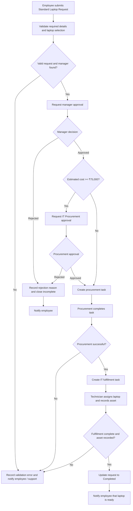

# Streamlining IT Procurement: Automating Standard Laptop Orders with Flow Designer

## 📌 Project Overview

This ServiceNow project demonstrates how Flow Designer can automate the lifecycle of a standard employee laptop request. It begins with a Service Catalog submission, validates request details, routes the request for the required approvals, coordinates procurement and IT fulfillment tasks, records the assigned asset, and closes the request with a notification to the employee.

The design uses standard ServiceNow request, task, user, group, and asset records. The approval thresholds, laptop prices, and workflow described below are a configurable demonstration design; confirm organizational policy, currency settings, and instance-specific choice values before production use.

## 🎯 Objectives

- Automate standard laptop requests through the Service Catalog.
- Reduce manual coordination and repetitive work for IT procurement and support teams.
- Route each valid request to the employee's manager for approval.
- Require additional procurement approval for higher-value laptop selections.
- Create and assign procurement and fulfillment tasks automatically.
- Improve request status visibility from submission through closure.
- Reduce avoidable processing delays with clear ownership and handoffs.
- Send timely notifications to employees, approvers, and fulfillment teams.

## 🏢 Business Problem

A manual laptop procurement process can rely on email, spreadsheets, and informal handoffs. This creates several challenges:

- Approval requests can be delayed, overlooked, or difficult to audit.
- Procurement teams may not receive complete specifications or cost-center details.
- Employees have limited visibility into the status of their requests.
- IT staff repeat administrative tasks such as creating work items and sending updates.
- It can be difficult to track the laptop from request through asset assignment.
- Ownership of exceptions, rejected requests, and stalled work may be unclear.

## 💡 Proposed Solution

ServiceNow Flow Designer coordinates the request lifecycle using a catalog trigger, record lookups, validation and decision logic, approval actions, task creation, wait conditions, record updates, and notifications.

Each request is represented by a Requested Item [sc_req_item]. The flow validates the requested-for employee, manager, cost center, required date, and laptop selection. It then requests manager approval and, when the estimated laptop cost is ₹75,000 or more, IT Procurement approval as well. After approvals, the flow creates a procurement Catalog Task [sc_task], waits for procurement completion, creates a fulfillment task, and waits for the technician to record the assigned asset. The request is marked complete only after the fulfillment task is complete and an asset has been recorded.

> **Configuration note:** Laptop prices in the examples are sample INR estimates. The flow should derive price from the allowed laptop model, not accept a price supplied by the requester.

## 🔄 Process Flow

## ⚙️ Technologies Used

- **ServiceNow** — service management platform.
- **Flow Designer** — visual workflow automation and orchestration.
- **Service Catalog** — employee request form and catalog variables.
- **Approvals** — manager and conditional IT Procurement decisions.
- **Notifications** — request, approval, procurement, and completion messages.
- **ServiceNow Tables** — requested items, catalog tasks, users, groups, and assets.
- **Asset Management** — recording and referencing the laptop assigned to the employee.

## 🧩 ServiceNow Components

| Component | Purpose in the project |
|---|---|
| Catalog Item | Presents the Standard Laptop Request form to employees. |
| Flow Designer | Coordinates validation, approvals, task handoffs, updates, and notifications. |
| Flow Trigger | Starts the flow when the specified catalog item is submitted. |
| Actions | Look up records, create tasks, update the requested item, send notifications, and wait for work completion. |
| Approvals | Capture manager and, for high-value requests, procurement decisions as approval records. |
| Conditions | Validate request data and route by approval outcome, cost threshold, and task result. |
| Notifications | Inform employees, approvers, procurement, and fulfillment teams at lifecycle milestones. |
| Catalog Tasks | Assign procurement and laptop assignment work to the responsible groups. |
| Assets | Link the assigned laptop to the completed request. |
| Users and Groups | Resolve the employee's manager and route approvals and tasks to responsible teams. |

## 📝 Catalog Item

Create a catalog item named **Standard Laptop Request** in the Service Catalog. Configure its variables as follows:

| Variable label | Suggested variable name | Type | Configuration |
|---|---|---|---|
| Requested For | `requested_for` | Reference | Reference `sys_user`; default to the logged-in user. |
| Department | `department` | Reference | Reference `cmn_department`; populate from Requested For where supported. |
| Manager | `manager` | Reference | Reference `sys_user`; display the employee's manager where supported. The flow independently resolves the manager from the user record. |
| Laptop Model | `laptop_model` | Select Box | Required; offer only the approved models listed below. |
| Business Justification | `business_justification` | Multi-line text | Required; capture the work need. |
| Required Date | `required_date` | Date | Required; validate that it is today or later. |
| Cost Center | `cost_center` | Reference | Reference `cmn_cost_center`; required and active. |

Set mandatory variables at the catalog-item level and make profile-derived Department and Manager read-only if they are populated automatically. Client-side behavior is for usability only; Flow Designer must perform authoritative validation before requesting approval or creating tasks.

## 💻 Laptop Options

Example model choices and estimated costs for demonstrating the approval threshold:

| Laptop option | Example stored value | Example estimate |
|---|---|---:|
| Standard Business Laptop | `standard_business_laptop` | ₹65,000 |
| Developer Laptop | `developer_laptop` | ₹95,000 |
| High-Performance Laptop | `high_performance_laptop` | ₹145,000 |

These costs are examples, not procurement quotes. Configure the final mapping in the flow or an approved price source. Do not expose editable price input to the requester.

## 🔀 Flow Designer Logic

Create a Flow in **All > Process Automation > Flow Designer** and name it **Standard Laptop Request - Approval, Procurement, Fulfillment**. Select the Service Catalog/requested-item trigger for the **Standard Laptop Request** catalog item. Labels can vary slightly across ServiceNow releases.

1. **Trigger:** Start once for each Requested Item created from the Standard Laptop Request catalog item.
2. **Validate request information:** Look up the Requested For user and Cost Center. Check the active user, mandatory values, valid model choice, future-or-current required date, and active cost center. If validation fails, set the request to Needs Attention, record the reason, close it incomplete, notify the employee/support team, and end.
3. **Identify the employee's manager:** Read `sys_user.manager` from the looked-up Requested For user. Do not route approval using an untrusted or stale client-side variable. If no manager exists, record a clear error and stop before creating approval or task records.
4. **Set estimated cost and stage:** Map the selected model to the configured estimate and update the Requested Item tracking fields. Set the processing stage to Manager Approval.
5. **Send manager approval:** Use Flow Designer **Ask for Approval** on the Requested Item, assigning the resolved manager. Include the model, estimate, cost center, required date, and justification in the approval context.
6. **Handle approval/rejection:** On rejection, record approver comments as the rejection reason, mark the request Rejected/Closed Incomplete, notify the employee, and end. On approval, continue.
7. **Process procurement approval:** If estimated cost is **greater than or equal to ₹75,000**, request approval from the IT Procurement group. If rejected, record comments, mark Rejected/Closed Incomplete, notify the employee, and end. Requests below the threshold skip this additional approval. Manager approval remains required for every valid request.
8. **Create procurement task:** Look up an existing active procurement task first to avoid duplicates. If none exists, create a Catalog Task linked to the Requested Item and assign it to **IT Procurement**. Include the model, estimate, employee, cost center, required date, and justification. Notify the procurement team.
9. **Wait for procurement completion:** Use **Wait for Condition** on the procurement task. Continue only when it closes successfully. If it closes unsuccessfully or is skipped, copy close notes to the request, mark Needs Attention/Closed Incomplete, notify the responsible parties, and do not create fulfillment work.
10. **Create fulfillment task:** Set the request stage to Fulfillment and create a Catalog Task assigned to **IT Hardware / Service Desk**. Ask the technician to assign the laptop and record its asset reference. Notify the fulfillment group that the laptop is ready for fulfillment.
11. **Assign and record the asset:** Wait for the fulfillment task to close. Continue only when it closes successfully and an asset is selected. Look up the referenced Asset record; a missing asset is a fulfillment exception, not a successful completion.
12. **Complete the request:** Update the Requested Item with the asset reference, set the processing stage to Completed and the standard request state to Closed Complete, and add an audit-friendly work note. Send the employee a completion notification with the asset identifier.

Use **Look Up Records**, **Create Record**, **Update Record**, **Ask for Approval**, **If / Else**, **Send Email/Notification**, and **Wait for Condition** actions. A reusable validation Subflow can accept the Requested Item and return validity, manager, department, cost, and error details. Keep human approval and task waits visible in the main flow for demonstration clarity.

### Error handling

| Condition | Handling |
|---|---|
| Missing manager | Stop before approval; record the error; set Needs Attention and Closed Incomplete; notify requester and Service Desk. |
| Invalid laptop model | Do not price, approve, or create tasks; record the invalid selection and notify support. |
| Missing or inactive cost center | Stop before approvals/tasks and notify requester/support. |
| Procurement failure | Copy procurement task close notes; do not create fulfillment task; route to Needs Attention and notify procurement lead/requester. |
| Fulfillment failure or no asset | Do not mark complete; record the failure and notify the Service Desk lead/requester. |
| Flow action/record error | Use Flow Designer error handling where available; preserve an actionable message on the request and alert the owning support group. |

## ✅ Approval Logic

| Estimated cost | Required approvals | Decision behavior |
|---:|---|---|
| Below ₹75,000 | Requested For user's Manager | All valid requests require manager approval. Approval advances; rejection records comments and ends the flow. |
| ₹75,000 or more | Manager, then IT Procurement group | Procurement approval is requested only after manager approval. Both must approve before procurement task creation. |

Use the Flow Designer **Ask for Approval** action so approvals are recorded and auditable. Configure the group approval behavior to match policy (for example, anyone in the group may approve); do not treat an email notification as an approval. Confirm the target release's group-approval action and approval state values in the instance.

## 🔔 Notifications

| Notification | Trigger point | Recipient |
|---|---|---|
| Request submitted | Immediately after catalog submission | Requested For |
| Approval required | Before manager or procurement approval action | Relevant approver/approval group |
| Request approved | After all approvals required for the selected model have approved | Requested For |
| Request rejected | When manager or procurement approval is rejected | Requested For; include rejection reason |
| Procurement started | Procurement task is created | IT Procurement group |
| Fulfillment started | Procurement completes and fulfillment task is created | IT Hardware / Service Desk group |
| Request completed | Request is closed complete with asset recorded | Requested For; include asset identifier |

Implement messages using Flow Designer notification/email actions or Notifications in **System Notification > Email > Notifications**. Choose one sending path per lifecycle event to prevent duplicate messages. Test recipients, links, and catalog variable rendering in the target instance.

## 🗃️ ServiceNow Tables

| Table | Purpose |
|---|---|
| Requested Item [`sc_req_item`] | Represents an individual catalog item request; holds request lifecycle, variables, approvals, stage tracking, and asset reference. |
| Catalog Task [`sc_task`] | Holds procurement and fulfillment work linked to the Requested Item. |
| User [`sys_user`] | Holds employee, manager, and department profile information. |
| Group [`sys_user_group`] | Represents IT Procurement and IT Hardware / Service Desk teams used for routing. |
| Asset [`alm_asset`] | Represents the laptop assigned to the employee; use the appropriate hardware subclass if required by the instance. |

Recommended minimal tracking fields on `sc_req_item` are `u_laptop_procurement_status` (choice: New, Manager Approval, Procurement Approval, Procurement, Fulfillment, Completed, Rejected, Needs Attention), `u_laptop_estimated_cost` (currency), `u_laptop_asset` (reference to `alm_asset`), and `u_laptop_processing_error` (string). A fulfillment task may use `u_laptop_asset` (reference to `alm_asset`) to capture the technician's assigned asset. Add fields through the organization's application/update-set process and review ACLs.

## 🧪 Testing

Execute these scenarios in a non-production instance. Inspect the Requested Item, approval records, Catalog Tasks, asset link, flow execution details, and notifications.

| # | Test Scenario | Expected Result | Actual Result | Status |
|---:|---|---|---|---|
| 1 | Submit a Standard Business Laptop request with valid employee, manager, cost center, justification, and required date; manager approves. | Manager approval is recorded; estimated cost is below ₹75,000; additional procurement approval is skipped; procurement and fulfillment proceed to completion when their tasks are successfully closed. | Not run | Not run |
| 2 | Manager rejects a valid request and enters a reason. | Request is marked Rejected/Closed Incomplete; rejection reason is recorded; no procurement or fulfillment task is created; employee is notified. | Not run | Not run |
| 3 | Request a Developer or High-Performance Laptop at or above ₹75,000; manager approves. | IT Procurement approval is created after manager approval; procurement task is not created until both approvals are approved. | Not run | Not run |
| 4 | Approve a request and verify procurement task creation. | One procurement Catalog Task is linked to the Requested Item and assigned to IT Procurement; group notification is sent. | Not run | Not run |
| 5 | Close procurement successfully and verify fulfillment task creation. | Request stage becomes Fulfillment; one fulfillment Catalog Task is assigned to IT Hardware / Service Desk; team notification is sent. | Not run | Not run |
| 6 | Technician closes fulfillment successfully with a valid laptop asset selected. | Asset is linked to the request; request is Closed Complete; employee receives completion notification. | Not run | Not run |
| 7 | Submit for an active user with no manager on the `sys_user` profile. | No approval or tasks are created; request records a missing-manager explanation, goes to Needs Attention/Closed Incomplete, and support/requester are notified. | Not run | Not run |
| 8 | Submit an invalid model, missing/inactive cost center, or past required date (bypass client validation in a non-production test if necessary). | Flow validation prevents approval/task creation, records the specific error, and notifies the appropriate support/requester. | Not run | Not run |

Populate **Actual Result** and **Status** only after executing each test. Suggested status values are `Pass`, `Fail`, and `Blocked`; attach execution links or screenshots as evidence where permitted.

## 📊 Expected Benefits

- Faster procurement through automated approvals and work assignment.
- Reduced manual effort for employees, approvers, and IT teams.
- Better approval control based on manager ownership and estimated cost.
- Improved visibility into pending, approved, rejected, procurement, fulfillment, and completed requests.
- Timely notifications at important handoffs and lifecycle milestones.
- Better asset traceability by linking the assigned laptop to the request.
- More consistent handling of validation errors and failed work.

## 🚀 Future Enhancements

- Automatic vendor selection based on approved supplier and pricing rules.
- Purchase order creation and status synchronization.
- Inventory availability checks before initiating procurement.
- Integration with external procurement or ERP systems.
- AI-based laptop recommendations based on role and approved standards.
- Automated asset assignment/reservation and employee acknowledgment.
- SLA-based escalation for overdue approvals and procurement/fulfillment tasks.
- Analytics for request volume, approval time, fulfillment time, and model demand.

## 📷 Screenshots

Add genuine screenshots from the configured non-production instance. Do not use placeholders as evidence of completed configuration.

| Screenshot | Placeholder |
|---|---|
| Service Catalog Item | `docs/screenshots/catalog-item.png` |
| Flow Designer | `docs/screenshots/flow-designer.png` |
| Approval step | `docs/screenshots/approval-step.png` |
| Procurement task | `docs/screenshots/procurement-task.png` |
| Fulfillment task | `docs/screenshots/fulfillment-task.png` |
| Completed request | `docs/screenshots/completed-request.png` |

> No screenshots are included yet. Replace each path with a real screenshot after capturing it, or remove rows that are not relevant to the submitted implementation.

## 📚 Learning Outcomes

This project provides a practical learning path for:

- Designing and testing flows in ServiceNow Flow Designer.
- Building Service Catalog items and configuring catalog variables.
- Automating a multi-stage workflow with conditions, lookups, and record actions.
- Managing user and group approvals with recorded decisions.
- Sending lifecycle notifications to the right recipients.
- Creating and coordinating Catalog Tasks across operational teams.
- Linking asset management records to service requests.
- Applying validation, exception handling, and request tracking in an ITSM process.

## 👨‍💻 Project Information

| Field | Details |
|---|---|
| Developer Name | `[Add developer name]` |
| Role | `[Add role]` |
| Project Type | ServiceNow IT Procurement Automation / Portfolio Project |
| Platform | ServiceNow Flow Designer and Service Catalog |
| Date | `[Add project date]` |

## 📄 Conclusion

The **Standard Laptop Request** workflow demonstrates how ServiceNow Flow Designer can bring approval, procurement, fulfillment, notifications, and asset recording into one traceable request lifecycle. By validating request data, routing decisions according to cost, assigning work to the appropriate groups, and closing only after asset assignment is confirmed, the design helps reduce manual handoffs and improve visibility for employees and IT teams. The configuration should be validated against the target instance's release, organizational approval policy, security model, and procurement processes before production deployment.
